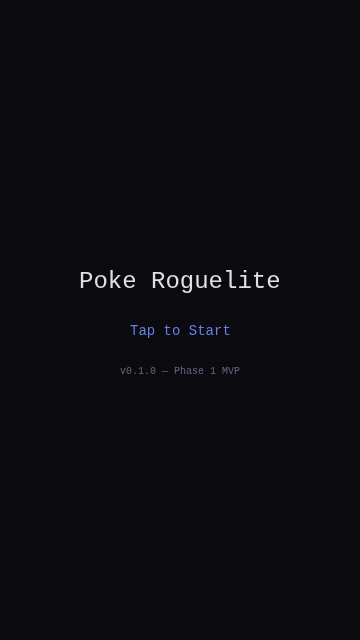
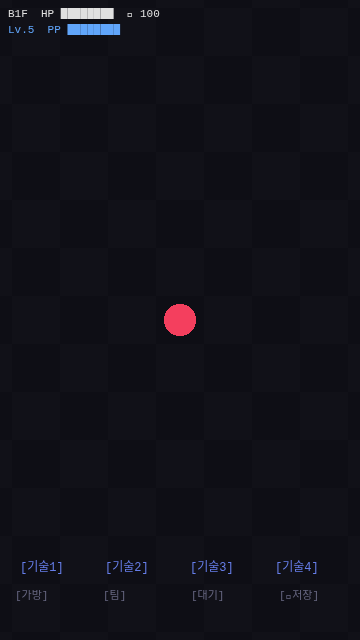

# 1-1. 프로젝트 세팅

## 목표
Phaser 3 + Vite + TypeScript 프로젝트를 세팅하고, 모바일 세로 화면(360×640)에서 동작 확인.

## 작업 과정

### Step 1: 프로젝트 초기화
```bash
npm init -y
npm install phaser rot-js
npm install -D vite typescript
```
- Phaser 3.90.0, rot-js 2.2.1, Vite 7.3.1, TypeScript 5.9.3

### Step 2: 프로젝트 구조
```
poke-roguelite/
├── index.html          # 엔트리 HTML (모바일 meta 태그 포함)
├── vite.config.ts      # Vite 설정 (host: 0.0.0.0, port: 3000)
├── tsconfig.json       # TypeScript 설정
├── package.json
└── src/
    ├── main.ts         # Phaser Game 인스턴스 생성
    ├── config.ts       # 게임 상수 (화면 크기, 타일 크기, 색상)
    └── scenes/
        ├── BootScene.ts    # 타이틀 화면
        └── DungeonScene.ts # 던전 메인 씬 (플레이스홀더)
```

### Step 3: 핵심 설정 값
```typescript
GAME_WIDTH = 360    // 모바일 세로 기준
GAME_HEIGHT = 640
TILE_SIZE = 24      // DTEF 원본 타일 크기
TILE_SCALE = 2      // 2배 렌더링
TILE_DISPLAY = 48   // 화면상 타일 크기
MAP_WIDTH = 24      // 맵 가로 타일 수
MAP_HEIGHT = 18     // 맵 세로 타일 수
```

### Step 4: Phaser 설정
- `Phaser.Scale.FIT` + `CENTER_BOTH`: 어떤 화면에서든 비율 유지하며 중앙 정렬
- `pixelArt: true`: 스프라이트 안티앨리어싱 방지
- `image-rendering: pixelated` (CSS): 캔버스 픽셀아트 선명하게

### Step 5: 실행 확인
- `npx vite --host 0.0.0.0 --port 3000` 으로 개발 서버 실행
- Phaser 3.90.0 WebGL 렌더러 정상 초기화 확인
- 콘솔 에러: favicon.ico 404만 발생 (무시 가능)

## 결과 스크린샷

### 부팅 화면

- "Poke Roguelite" 타이틀, "Tap to Start" 버튼, 버전 표시

### 던전 씬 (플레이스홀더)

- 24×18 체커보드 맵 (벽: 어두운 테두리)
- 핑크색 원 = 플레이어 위치
- 상단 HUD: 층수, HP, 배고픔, 레벨, PP
- 하단: 기술 4슬롯 + 메뉴 버튼 (가방/팀/대기/저장)
- 카메라가 플레이어 중심으로 정렬

## 이슈/메모
- WebGL ReadPixels GPU stall 경고는 headless 환경에서만 발생. 실기기에서는 안 남
- favicon.ico 추후 추가 예정
