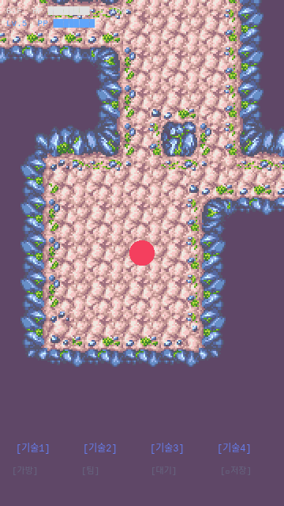

# 1-2. 던전 생성 + DTEF 오토타일링 + 타일맵 렌더링

## 목표
rot.js로 던전(방+복도)을 생성하고, DTEF 포맷의 BeachCave 타일셋으로 오토타일링 렌더링.

## 작업 과정

### Step 1: BeachCave 타일셋 다운로드
pokemonAutoChess 리포에서 BeachCave 타일셋 11개 파일 다운로드.
```
public/tilesets/BeachCave/
├── metadata.json           (6.6KB - 마스크 정의, firstgid)
├── tileset_0.png           (150KB - 정적 타일 18×8 = 144타일)
├── tileset_0.json          (타일셋 메타: 18열, 24×24px)
├── tileset_0_frame0.png    (296KB - 물 애니메이션 프레임0)
├── tileset_0_frame1.png    (430KB - 물 애니메이션 프레임1)
└── ... (총 11파일, ~1.1MB)
```

### Step 2: 던전 생성기 (dungeon-generator.ts)
- rot.js `ROT.Map.Uniform` 사용
- 방 크기: 3~7 × 3~5, dugPercentage: 0.4
- 출력: `DungeonData` (terrain 2D 배열, rooms, playerStart, stairsPos)
- TerrainType: WALL=0, WATER=1, GROUND=2

### Step 3: DTEF 오토타일러 (autotiler.ts) - 핵심

#### 첫 시도: Linear 매핑 (실패)
metadata.json의 maskDefinition 순서가 곧 타일 위치라고 가정.
즉, 마스크 인덱스 `i` → 위치 `(i%6, floor(i/6))`.

**결과: 검은 타일 발생!**


방과 복도는 보이지만 곳곳에 검은 타일이 발생. 마스크 매핑이 틀렸음.

#### 원인 분석
pokemonAutoChess 소스코드 (`app/config/maps/tileset.ts`)를 분석한 결과,
DTEF 포맷은 linear 매핑이 아닌 **고유한 MaskCoordinate 룩업 테이블**을 사용.

예시:
- `X` (고립) → `(4, 1)` (linear라면 `(0, 0)`)
- `A1B2C3D4` (완전 둘러쌓임) → `(1, 1)` (linear라면 `(4, 7)`)
- `AB` (위+오른쪽) → `(3, 2)` (linear라면 `(5, 0)`)

완전히 다른 좌표 체계였음.

#### 수정: MaskCoordinate 테이블 적용

```
6×8 그리드 실제 배치:
     x=0       x=1        x=2      x=3    x=4    x=5
y=0 [B2C     , B2C3D   , C3D    , BC   , BD   , CD   ]
y=1 [A1B2C   , A1B2C3D4, AC3D4  , AC   , X    , AD   ]
y=2 [A1B     , A1BD4   , AD4    , AB   , C    , ─    ]
y=3 [ABC3D4  , A1B2CD  , BCD    , B    , ABCD , D    ]
y=4 [AB2C3D  , A1BCD4  , ABD    , ABC  , A    , ACD  ]
y=5 [A1BC3D4 , A1B2CD4 , A1BC   , ACD4 , BC3D , B2CD ]
y=6 [AB2C3D4 , A1B2C3D , AB2C   , AC3D , ABD4 , A1BD ]
y=7 [AB2CD   , ABC3D   , A1BCD  , ABCD4, A1BC3D, AB2CD4]
```

**결과: 완벽한 오토타일링!**



### Step 4: DungeonScene 타일맵 렌더링
- `preload()`: tileset_0.png 이미지 로드
- `create()`:
  1. `generateDungeon()` 호출 → terrain 배열 생성
  2. 각 타일에 `getTileIndex()` → 2D tile index 배열 생성
  3. `this.make.tilemap({ data, tileWidth: 24, tileHeight: 24 })`
  4. `layer.setScale(2)` → 48px 표시
  5. 계단(노란 다이아몬드) + 플레이어(핑크 원) 오버레이
  6. 카메라: 플레이어 중심, 맵 범위 설정

### Step 5: 포트 충돌 해결
poke-survivor가 포트 3000을 점유하고 있어서, poke-roguelite를 3001로 변경.
vite.config.ts의 `server.port: 3001`로 수정.

## 핵심 코드

### autotiler.ts (DTEF 47-state bitmask)
```typescript
// 이웃 비트 구성:
//   4  A  1
//   D  X  B
//   3  C  2
// 대각선은 인접 카디널 양쪽이 매칭될 때만 카운트

// 마스크 이름 생성: A[1]B[2]C[3]D[4] 순서
let name = "";
if (a) name += "A";
if (d1) name += "1";  // a && b && 대각선 매칭
if (b) name += "B";
if (d2) name += "2";
if (c) name += "C";
if (d3) name += "3";
if (d) name += "D";
if (d4) name += "4";

// MaskCoordinate[name] → {x, y} 룩업
// 타일 인덱스 = y * 18 + (x + terrainType * 6)
```

## 이슈/메모
- **DTEF Linear 매핑 함정**: metadata.json의 마스크 순서가 타일 위치라고 착각하기 쉬움.
  실제로는 pokemonAutoChess의 MaskCoordinate 룩업 테이블을 사용해야 함.
- **포트 충돌**: 같은 머신에서 survivor와 roguelite 동시 개발 시 포트 분리 필요.
- 물(WATER) 타일은 아직 미사용. 추후 특수 던전에서 활용 예정.
- 타일셋 애니메이션(frame0, frame1)은 Phase 1에서는 미구현.

## 결과 스크린샷

### 첫 시도 (Linear 매핑 - 검은 타일 발생)


### 최종 결과 (MaskCoordinate 룩업 테이블 적용)

