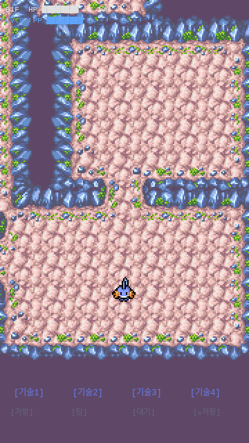
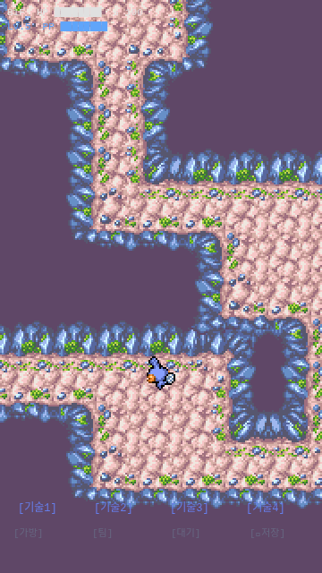

# 1-3. 포켓몬 스프라이트 + 8방향 이동 + 카메라

## 목표
Mudkip PMD 스프라이트 로드, 8방향 탭 이동, 카메라 플레이어 추적 구현.

## 작업 과정

### Step 1: PMD 스프라이트 리서치
두 가지 소스 확인:
1. **PMDCollab/SpriteCollab** (선택) - 개별 애니메이션 PNG + AnimData.xml
2. **pokemonAutoChess** - Phaser TextureAtlas JSON 포맷

PMDCollab을 선택한 이유:
- 각 애니메이션이 단순한 그리드 스프라이트시트 (열=프레임, 행=방향)
- AnimData.xml로 프레임 크기/듀레이션 명확히 정의
- 개별 파일이라 필요한 것만 다운로드 가능

### Step 2: Mudkip 스프라이트 다운로드

```
public/sprites/0258/
├── AnimData.xml    (메타데이터: 프레임 크기, 듀레이션)
├── Walk-Anim.png   (32×40 × 6프레임 × 8방향 = 192×320px)
├── Idle-Anim.png   (24×40 × 7프레임 × 8방향 = 168×320px)
├── Attack-Anim.png (72×80 × 10프레임 × 8방향)
└── Hurt-Anim.png   (48×56 × 2프레임 × 8방향)
```

방향 매핑 (행 인덱스):
| Row | Direction |
|-----|-----------|
| 0 | Down |
| 1 | DownRight |
| 2 | Right |
| 3 | UpRight |
| 4 | Up |
| 5 | UpLeft |
| 6 | Left |
| 7 | DownLeft |

### Step 3: Direction 시스템 (direction.ts)
- 8방향 enum (PMD 스프라이트 행 순서와 일치)
- DIR_DX/DIR_DY: 각 방향의 타일 오프셋
- `angleToDirection()`: 탭 각도 → 가장 가까운 8방향 변환
  - Math.atan2 기반, 22.5° 오프셋으로 45° 섹터 분할

### Step 4: DungeonScene 업데이트
핵심 변경:
1. **preload**: Walk/Idle 스프라이트시트 로드 (`this.load.spritesheet`)
2. **애니메이션 생성**: 8방향 × Walk(6프레임) + Idle(7프레임) = 16개 애니메이션
3. **플레이어 스프라이트**: 핑크 원 → 실제 Mudkip 스프라이트로 교체
4. **탭 이동**: pointerdown → 각도 계산 → 방향 → tryMove()
5. **카메라**: centerOn → `startFollow(playerSprite, true, 0.15, 0.15)` (부드러운 추적)

이동 로직 (tryMove):
```
1. 방향별 dx, dy 계산
2. 범위 체크 (맵 밖 방지)
3. 충돌 체크 (GROUND 타일만 이동 가능)
4. 대각선 이동: 양쪽 카디널 방향도 GROUND여야 통과
5. Walk 애니메이션 재생 + 위치 트윈 (180ms)
6. 완료 시 Idle 애니메이션 전환
```

### Step 5: Headless 브라우저 테스트 이슈
- **문제**: playwright-cli의 mousedown이 Phaser의 pointerdown을 트리거하지 못함
- **원인**: Phaser는 캔버스 기반 자체 입력 시스템 사용
- **해결**: `window.__GAME`으로 game 인스턴스 노출 → `scene.start()` 직접 호출
- **결과**: 씬 전환 성공, 이동도 포인터 이벤트로 정상 동작

## 결과 스크린샷

### Mudkip 초기 위치 (Idle 애니메이션)


### 이동 후 (카메라 추적 확인)

- 복도를 따라 이동
- 카메라가 플레이어를 부드럽게 추적
- 벽 충돌 정상 동작
- 방향에 따른 스프라이트 회전 확인

## 이슈/메모
- PMD 스프라이트는 의도적으로 작음 (24-32px). 타일(48px)보다 작은 것이 정상.
- Walk과 Idle의 프레임 크기가 다름 (32×40 vs 24×40). 전환 시 약간의 시각적 차이 발생 가능.
- 대각선 이동 시 양쪽 카디널이 모두 통과 가능해야 하는 제약 추가 (벽 사이로 끼기 방지).
- Attack/Hurt 스프라이트는 다운로드했으나 Phase 1-5에서 사용 예정.
