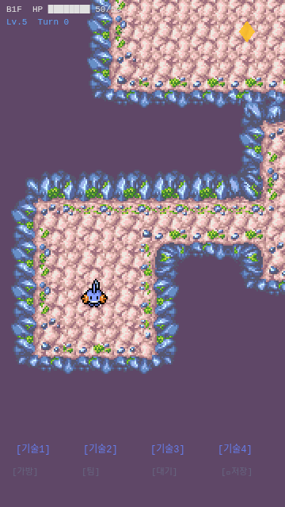
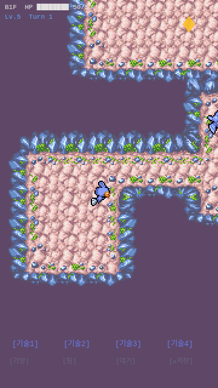

# 1-4. 턴 시스템 + 적 AI + 기본 전투

## 목표
턴 기반 시스템 도입: 플레이어 행동 → 적 행동 순서, 적 스폰, AI 추적/공격, 기본 전투.

## 작업 과정

### Step 1: 적 포켓몬 스프라이트 다운로드
- Zubat(주뱃, #0041) 선택 — 해변동굴 테마에 적합한 동굴 포켓몬
- Walk: 32×56 × 8프레임 × 8방향
- Idle: 32×56 × 8프레임 × 8방향

### Step 2: Entity 시스템 (entity.ts)
```typescript
interface Entity {
  tileX, tileY: number;
  facing: Direction;
  stats: { hp, maxHp, atk, def, level };
  alive: boolean;
  sprite?: Phaser.GameObjects.Sprite;
  spriteKey: string;
}
```
유틸리티 함수:
- `canMoveTo()`: 범위+지형+다른 엔티티 점유 체크
- `canMoveDiagonal()`: 대각선 이동 시 양쪽 카디널 통과 체크
- `chebyshevDist()`: 8방향 기준 거리 (대각선=1)

### Step 3: Turn Manager (turn-manager.ts)
```
1. 플레이어 행동 (이동 또는 공격)
2. 모든 적 순차 행동
3. 턴 카운터 증가
```
- `executeTurn(playerAction, enemyActions[])` — async/await 기반
- `isBusy` 플래그로 중복 입력 방지

### Step 4: 적 AI (enemy-ai.ts)
- **감지 범위**: 5타일 (Chebyshev 거리)
- **행동 우선순위**:
  1. 인접(dist≤1): 공격
  2. 감지 범위 내: 가장 가까워지는 방향으로 이동
  3. 범위 밖: 대기
- `directionToPlayer()`: 공격 시 방향 계산

### Step 5: 전투 시스템
- **데미지 공식**: `max(1, ATK - DEF/2)`
- **플레이어 스탯**: HP 50, ATK 12, DEF 6, Lv.5
- **Zubat 스탯**: HP 20, ATK 8, DEF 3, Lv.3
- **사망 처리**: HP 0 → alive=false → 스프라이트 페이드 아웃(300ms)
- **시각 피드백**: 피격 시 빨간 틴트(200ms)
- **로그 메시지**: 하단에 "Mudkip attacks Zubat! 10 damage!" 표시 (2초 후 자동 소멸)

### Step 6: 적 스폰
- 첫 번째 방(플레이어 방) 제외, 각 방에 1마리씩 Zubat 스폰
- 방 내부 랜덤 위치 (벽/계단 위치 제외)
- 계단 위에는 스폰 안 됨

### Step 7: HUD 업데이트
- HP 바: `████████` + `░░░░░░░░` (채움/빈칸 블록)
- 턴 카운터: "Turn 0", "Turn 1", ...
- 전투 로그: 노란색 텍스트, 하단 표시

## 결과 스크린샷

### 던전 진입 (Mudkip + Zubat 스폰 확인)

- Mudkip이 시작 방에 위치
- 우측에 Zubat(보라색 박쥐) 확인
- HUD: "B1F HP ████████ 50/50" + "Lv.5 Turn 0"

### 이동 후 (턴 진행 확인)

- Turn 0 → Turn 1 로 증가
- Mudkip이 복도 방향으로 이동

## 핵심 아키텍처

```
DungeonScene
├── TurnManager (턴 순서 제어)
├── Player (Entity)
├── Enemies[] (Entity[])
├── handlePlayerAction(dir)
│   ├── 적이 있으면 → performAttack()
│   └── 없으면 → moveEntity() + 적 턴 실행
├── getEnemyActions()
│   ├── 인접 → performAttack(enemy, player)
│   └── 범위내 → moveEntity(enemy, bestDir)
└── performAttack(attacker, defender)
    ├── 데미지 계산
    ├── 빨간 틴트 피드백
    └── HP 0이면 사망 처리
```

## 이슈/메모
- **playwright-cli 세션 혼동**: poke-survivor(3000)와 poke-roguelite(3001)이 같은 브라우저에서 혼동됨.
  해결: `-s=roguelite` 네임드 세션으로 분리.
- **Headless 입력**: Phaser pointerdown이 headless에서 불안정. `window.__GAME` + `scene.start()` 직접 호출로 우회.
- Phase 1-5의 타입상성 시스템은 별도 구현 예정 (현재는 단순 ATK-DEF/2).
