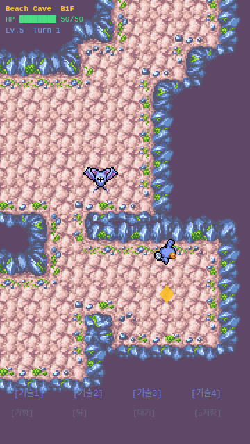

# 1-5~6. 타입 상성 + 계단 + 층수 시스템

## 목표
타입 상성 데미지, 계단 상호작용, 층수 진행(B1F~B5F), 적 스케일링, 승리/패배 조건.

## 작업 과정

### Step 1: 타입 상성 시스템 (type-chart.ts)
- `PokemonType` enum: Water, Fire, Grass, Electric, Flying, Poison, Ground, Rock, Bug, Normal
- `EFFECTIVENESS` 테이블: 공격타입 → 방어타입 → 배율 (2.0/0.5/0)
- `getEffectiveness(attackType, defenderTypes[])`: 듀얼타입 지원, 배율 곱셈
- `effectivenessText()`: "It's super effective!" / "It's not very effective..."

### Step 2: Entity에 타입 정보 추가 (entity.ts)
```typescript
interface Entity {
  // ...기존 필드...
  name: string;           // "Mudkip", "Zubat"
  types: PokemonType[];   // 방어 타입
  attackType: PokemonType; // 기본 공격 타입 (STAB)
}
```
- Mudkip: Water 타입, Water 공격
- Zubat: Poison/Flying 듀얼타입, Flying 공격

### Step 3: 전투에 타입 상성 적용
- 기존 공식: `max(1, ATK - DEF/2)`
- 새 공식: `max(1, floor((ATK - DEF/2) × effectiveness))`
- Water → Poison/Flying = 1.0 (중립, 서로 상쇄)
- Flying → Water = 1.0 (중립)
- 피격 색상: 효과적(2x)=빨강, 미미(0.5x)=파랑, 보통=진홍

### Step 4: 층수 시스템 (DungeonScene)
- `init(data?)` 메서드: `{ floor, hp, maxHp }` 데이터 수신
- `currentFloor`: B1F~B5F (기본값 1)
- `persistentHp/MaxHp`: 층 간 HP 유지
- HUD 업데이트: "Beach Cave B1F" 표시 + HP 색상 변경 (>50% 초록, >25% 노랑, 이하 빨강)

### Step 5: 적 스케일링
```typescript
function getEnemyStats(floor: number) {
  const scale = 1 + (floor - 1) * 0.25;
  return {
    hp: floor(20 * scale),    // 20, 25, 30, 35, 40
    atk: floor(8 * scale),    // 8, 10, 12, 14, 16
    def: floor(3 * scale),    // 3, 3, 4, 5, 6
    level: 2 + floor,         // 3, 4, 5, 6, 7
  };
}
```

### Step 6: 계단 상호작용
- 플레이어가 이동 후 `checkStairs()` 호출
- 계단 타일 위에 있으면 `advanceFloor()` 실행
- 카메라 페이드 아웃(500ms) → `scene.restart({ floor+1, hp, maxHp })`
- B5F에서 계단 밟으면 클리어

### Step 7: 승리/패배 조건
- **승리**: B5F 계단 도달 → 반투명 오버레이 + "DUNGEON CLEAR!" 메시지 + 펄스 애니메이션
- **패배**: HP 0 → "GAME OVER" + "Fainted on B{N}F" + 재시작 버튼
- 양쪽 모두 "[Tap to restart]"로 B1F부터 재시작

### Step 8: preserveDrawingBuffer
- WebGL canvas 스크린샷을 위해 `main.ts`에 `render: { preserveDrawingBuffer: true }` 추가
- 이전까지 headless 스크린샷이 하얀 화면이었던 이유: WebGL drawingBuffer가 프레임 사이에 클리어됨

## 결과 스크린샷

### B1F 진입 (새 HUD 확인)

- "Beach Cave B1F" 층 표시 (노란색 강조)
- HP 바 초록색 (HP > 50%)
- "Lv.5 Turn 1" 표시
- 계단 마커(노란 다이아몬드) 확인

## 핵심 아키텍처

```
DungeonScene
├── init(data?)          ← floor, hp, maxHp 수신
├── currentFloor (1~5)
├── persistentHp         ← 층 간 HP 유지
│
├── performAttack()
│   ├── getEffectiveness(attackType, defenderTypes)
│   ├── baseDmg × effectiveness
│   └── "It's super effective!" 로그
│
├── checkStairs()        ← moveEntity 후 호출
│   └── advanceFloor()
│       ├── floor < 5: fadeOut → scene.restart({floor+1})
│       └── floor = 5: showDungeonClear()
│
├── showDungeonClear()   ← 오버레이 + 승리 메시지
└── showGameOver()       ← 오버레이 + 패배 메시지
```

## 파일 변경

| 파일 | 변경 |
|------|------|
| `src/core/type-chart.ts` | **신규** — 타입 enum, 상성 테이블, 유틸리티 |
| `src/core/entity.ts` | name, types, attackType 필드 추가 |
| `src/scenes/DungeonScene.ts` | 층수, 계단, 타입상성, 승리/패배 통합 |
| `src/main.ts` | preserveDrawingBuffer, WEBGL 모드 |

## 이슈/메모
- **Mudkip vs Zubat 상성**: Water → Poison(중립) × Flying(중립) = 1.0배. 실질적으로 상성 효과 없음. 이후 다양한 적 포켓몬(Fire, Rock, Ground) 추가 시 상성이 의미를 갖게 됨.
- **Headless 스크린샷 문제**: preserveDrawingBuffer 설정 전에는 WebGL canvas가 하얀 화면으로 캡처됨. Phaser 게임의 headless 테스트 시 필수 설정.
- **HMR 안정성**: Vite HMR이 Phaser 게임에서 불안정 — 파일 변경 시 about:blank으로 전환되는 경우 있음. 브라우저 세션 재시작으로 해결.
