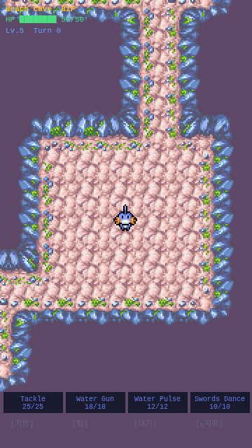

# 2-1. 기술(스킬) 시스템

## 목표
PMD 스타일 4-기술 슬롯 시스템. PP 소모, 범위 타겟팅, 타입 상성 적용, 버프/디버프.

## 구현 내용

### 스킬 데이터 구조 (skill.ts)
```typescript
interface Skill {
  id, name, type: PokemonType,
  power, pp, currentPp,
  range: SkillRange,
  accuracy: number,     // 0-100%
  effect?: SkillEffect,
  effectChance?: number
}
```

### 6가지 범위 유형 (SkillRange)
| 범위 | 설명 | 구현 |
|------|------|------|
| Front1 | 정면 1칸 | 기본 근접 |
| Front2 | 정면 2칸 | 중거리 |
| FrontLine | 직선 10칸 (벽에서 멈춤) | 관통 원거리 |
| Around | 주변 8칸 | 범위 공격 |
| Room | 방 전체 (BFS 반경 5) | 광역 |
| Self | 자신 | 버프/힐 |

### 스킬 데이터베이스 (9개 기술)
**Mudkip 기본셋**:
- Tackle (Normal/8pow/25pp/Front1) — 기본 물리
- Water Gun (Water/12pow/18pp/FrontLine) — 직선 관통
- Water Pulse (Water/15pow/12pp/Front2) — 2칸 중거리
- Swords Dance (Normal/0pow/10pp/Self) — ATK +50% 5턴

**Zubat 기본셋**:
- Wing Attack (Flying/12pow/20pp/Front1) — 기본 물리
- Leech Life (Bug/10pow/12pp/Front1) — HP 흡수
- Poison Sting (Poison/8pow/20pp/Front2) — 독 공격
- Supersonic (Normal/0pow/15pp/FrontLine) — 마비

### 스킬 타겟팅 (skill-targeting.ts)
- `getSkillTargetTiles()`: 범위 유형별 영향 타일 계산
- Front계열: 직선으로 벽까지 탐색
- Room: BFS 홍수 채우기 (Chebyshev 반경 5)
- Around: 8방향 인접 타일

### 데미지 공식
- **기본 공격**: `max(1, ATK_eff - DEF_eff/2) × type_effectiveness`
- **기술 공격**: `max(1, floor(power × ATK_eff / 10) - DEF_eff/2) × type_effectiveness`
- ATK_eff = ATK × 1.5 (칼춤 활성 시)

### 상태 효과 (StatusEffect)
- AtkUp: ATK ×1.5, 5턴
- DefUp: DEF ×1.5, 5턴
- Paralyze: 50% 확률로 턴 스킵, 3턴
- Burn: DoT (미구현, 향후)
- Heal: HP 30% 회복

### PP 시스템
- 기술 사용 시 1PP 소모
- 이동 턴마다 랜덤 1기술의 PP 1 회복
- PP 0이면 기술 사용 불가 (회색 버튼)

### UI 변경
- 하단 4개 기술 버튼: 이름 + PP 표시
- 기술 선택 시 노란색 하이라이트 + "Tap a direction" 안내
- 같은 버튼 다시 탭하면 선택 해제
- Self 기술은 즉시 발동 (방향 불필요)
- 상태 효과가 HUD에 표시: `atkUp(5)` 등

### 적 AI 스킬 사용
- 인접 시 40% 확률로 랜덤 기술 사용 (나머지 60% 기본 공격)
- 마비 상태에서 50% 확률로 턴 스킵

### 층 이동 시 스킬 PP 유지
- `scene.restart()`에 skills 배열 전달

## 결과 스크린샷



## 파일 변경

| 파일 | 변경 |
|------|------|
| `src/core/skill.ts` | **신규** — Skill 인터페이스, DB, 기본셋 |
| `src/core/skill-targeting.ts` | **신규** — 범위별 타겟 타일 계산 |
| `src/core/entity.ts` | skills[], statusEffects[], 버프 유틸 추가 |
| `src/scenes/DungeonScene.ts` | 스킬 버튼 UI, performSkill, PP 회복, 적 AI 스킬 |
