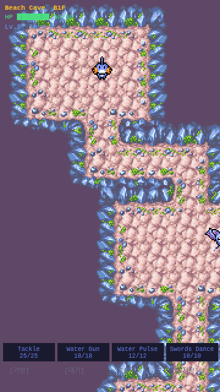

# 2-2. 아이템 시스템

## 목표
PMD 스타일 아이템 — 열매(회복), 씨앗(투척), 오브(특수). 던전 바닥 드롭, 줍기, 가방 UI, 사용.

## 구현 내용

### 아이템 데이터 (item.ts)

**3가지 카테고리**:
| 카테고리 | 아이콘 | 색상 | 용도 |
|---------|--------|------|------|
| Berry ● | 분홍 | 자기 사용 (회복) |
| Seed ◆ | 초록 | 투척 (정면 적) |
| Orb ★ | 파랑 | 특수 효과 |

**9개 아이템**:
| 아이템 | 효과 |
|--------|------|
| Oran Berry | HP 30 회복 |
| Sitrus Berry | HP 50% 회복 |
| Pecha Berry | 모든 상태이상 해제 |
| Revive Seed | 기절 시 자동 발동, HP 50% 부활 |
| Blast Seed | 정면 적에 고정 40 데미지 |
| Sleep Seed | 정면 적 5턴 마비 |
| Escape Orb | 즉시 던전 탈출 |
| Luminous Orb | 층 전체 지도 공개 (시각효과 미구현) |
| All-Power Orb | ATK+DEF 10턴 부스트 |

### 드롭 시스템
- 층당 3개 아이템 랜덤 스폰 (방 내부)
- 가중치 기반 롤: 오란열매(30) > 블래스트시드(15) > ... > 탈출오브(3)
- 바닥에 텍스트 아이콘으로 표시 (●/◆/★)

### 인벤토리
- 최대 16개 슬롯
- 같은 아이템은 스택 (stackable)
- 층 이동 시 인벤토리 유지

### 가방 UI
- [가방] 버튼 → 전체 화면 인벤토리 오버레이
- 각 아이템 옆에 [Use] 버튼
- 아이템 설명 표시
- 오버레이 밖 클릭 또는 [Close]로 닫기

### 메뉴 버튼 기능화
- [가방]: 인벤토리 열기/닫기
- [대기]: 턴 스킵 (PP 회복 + 적 행동)
- [줍기]: 발밑 아이템 줍기

### Revive Seed 특수 처리
- 기절 판정(`checkDeath`) 시 인벤토리에 Revive Seed가 있으면 자동 소모
- HP 50%로 부활, 초록 플래시 효과

## 결과 스크린샷

## 파일 변경

| 파일 | 변경 |
|------|------|
| `src/core/item.ts` | **신규** — 아이템 정의, DB, 드롭 테이블 |
| `src/scenes/DungeonScene.ts` | 아이템 스폰, 줍기, 가방 UI, 사용 로직, 메뉴 기능화 |
