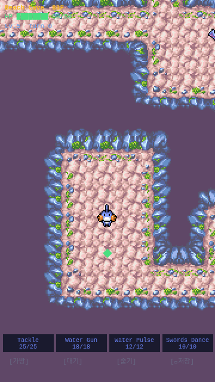

# 2-3. 다양한 적 포켓몬 추가

## 목표
해변동굴에 층별로 다른 적 포켓몬 등장. PMDCollab 스프라이트 추가. 데이터 기반 포켓몬 시스템.

## 추가된 포켓몬

| 포켓몬 | 타입 | 공격타입 | 등장 층 | 특징 |
|--------|------|----------|---------|------|
| Zubat | Poison/Flying | Flying | B1~B3F | 약하지만 빠름 |
| Shellos | Water | Water | B2~B4F | 낮은 ATK, 높은 DEF |
| Corsola | Water/Rock | Water | B3~B5F | 균형잡힌 스탯 |
| Geodude | Rock/Ground | Rock | B4~B5F | 높은 ATK+DEF, Water에 약함 |

### 타입 상성 요약 (Mudkip 기준)
- **vs Zubat**: Water → Poison(중립)×Flying(중립) = ×1.0
- **vs Shellos**: Water → Water(비효과) = ×0.5 (같은 Water 타입!)
- **vs Corsola**: Water → Water(비효과)×Rock(효과) = ×1.0 (상쇄)
- **vs Geodude**: Water → Rock(효과)×Ground(효과) = ×4.0 **(초효과!)**

이 상성 구조 덕분에:
- B1~B3: 중립적 전투
- B4~B5: Geodude 상대로 Water 기술이 4배 데미지!

## pokemon-data.ts (신규 모듈)
- `PokemonSpecies` 인터페이스: 스프라이트 정보, 타입, 기본 스탯, 등장 층
- `SPECIES` 레코드: 5종 포켓몬 데이터
- `getFloorEnemies(floor)`: 층별 등장 종 반환
- `createSpeciesSkills(species)`: 종별 기술셋 생성

## 스프라이트 프레임 정보 (AnimData.xml 확인)
| 포켓몬 | Walk | Idle |
|--------|------|------|
| Shellos | 32×32, 6f | 24×24, 3f |
| Corsola | 24×32, 4f | 24×32, 3f |
| Geodude | 32×32, 4f | 32×24, 4f |

## DungeonScene 리팩토링
- preload: 5종 스프라이트 동적 로드 (SPECIES 기반)
- create: animations를 모든 SPECIES에 대해 생성
- 적 스폰: `getFloorEnemies(floor)` → 층별 적 풀에서 랜덤 선택
- `getEnemyStats(floor, species)`: 종별 기본 스탯 × 층 스케일링

## 새 기술: Rock Throw
- Geodude용 기술 추가 (Rock/12pow/15pp/Front2)

## 결과 스크린샷

B3F — Shellos와 Corsola 혼합 등장

## 파일 변경

| 파일 | 변경 |
|------|------|
| `src/core/pokemon-data.ts` | **신규** — 종 데이터, 층별 적 관리 |
| `src/scenes/DungeonScene.ts` | SPECIES 기반 리팩토링 |
| `public/sprites/0422/` | **신규** — Shellos 스프라이트 |
| `public/sprites/0222/` | **신규** — Corsola 스프라이트 |
| `public/sprites/0074/` | **신규** — Geodude 스프라이트 |
