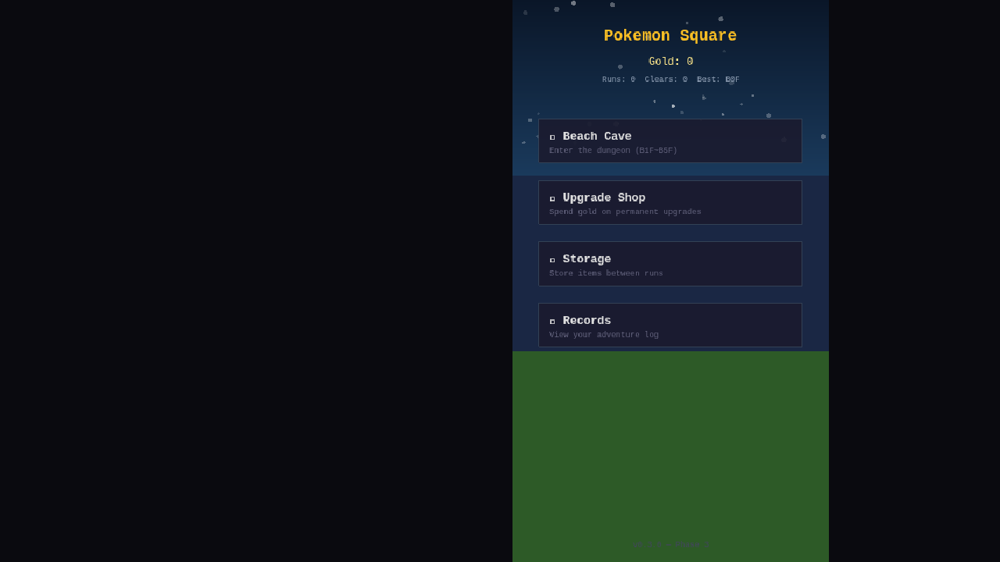
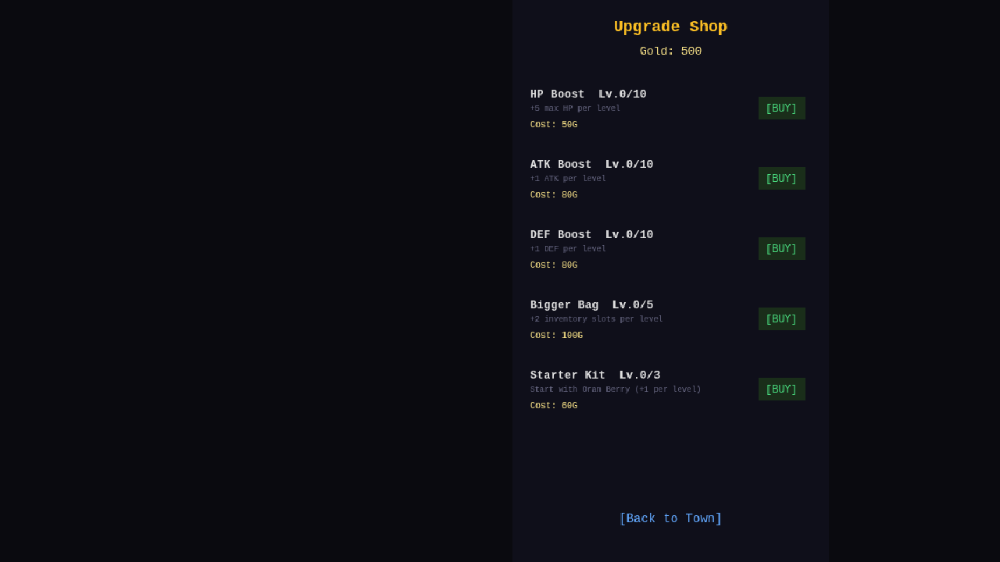
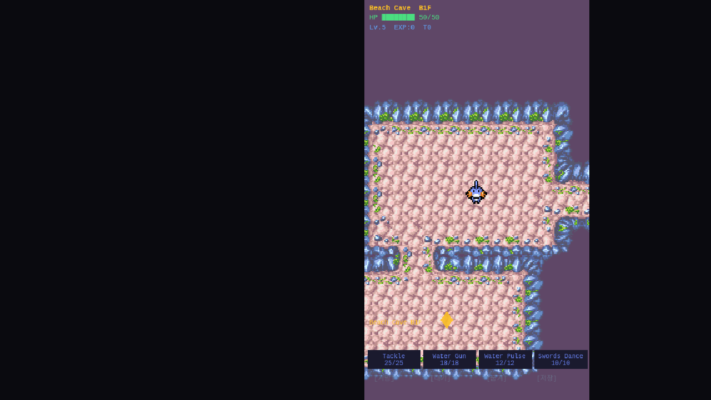

# Phase 3: 메타 진행 시스템

## 목표
던전 외부 진행 시스템: 허브 마을, 세이브, 골드, 영구 업그레이드.

## 구현 내용

### 3-1. Save System (localStorage)
- `save-system.ts` 신규 모듈
- **던전 세이브**: 층, HP, 레벨, 스킬(ID+PP), 인벤토리(ID+수량)
- **메타 세이브**: 골드, 기록, 업그레이드 레벨
- 직렬화/역직렬화 헬퍼 (스킬, 아이템)
- [저장] 버튼으로 던전 내 수동 저장

### 3-2. Hub Town (Pokemon Square)
- `HubScene.ts` 신규 씬
- 밤하늘 + 별 반짝임 + 초록 잔디 배경
- Gold 표시, 런 기록 (Runs, Clears, Best Floor)
- 5개 시설 버튼:
  1. **Beach Cave** — 던전 입장 (새 런)
  2. **Continue Saved Run** — 세이브 이어하기 (세이브 있을 때만)
  3. **Upgrade Shop** — 영구 업그레이드 구매
  4. **Storage** — 아이템 보관 (추후)
  5. **Records** — 모험 기록 조회

### 3-3. Gold System
- `goldFromRun(floor, enemiesDefeated, cleared)` 공식
- 클리어: `(floor × 20 + kills × 5) × 2`
- 실패: `(floor × 20 + kills × 5) × 0.5`
- Escape Orb 사용 시에도 골드 획득
- 던전 클리어/패배 → "Return to Town"으로 허브 복귀

### 3-4. Upgrade Shop
- `UpgradeScene.ts` 신규 씬
- 5가지 영구 업그레이드:

| 업그레이드 | 효과 | 최대 | 기본 비용 |
|-----------|------|------|----------|
| HP Boost | +5 max HP/레벨 | Lv.10 | 50G |
| ATK Boost | +1 ATK/레벨 | Lv.10 | 80G |
| DEF Boost | +1 DEF/레벨 | Lv.10 | 80G |
| Bigger Bag | +2 슬롯/레벨 | Lv.5 | 100G |
| Starter Kit | 시작 시 Oran Berry +1/레벨 | Lv.3 | 60G |

- 비용 공식: `baseCost + currentLevel × costScale`
- 새 런 시작 시 업그레이드 보너스 자동 적용

### Game Flow 변경
```
Boot → Hub (Pokemon Square) → Beach Cave B1F~B5F → Clear/GameOver → Hub
                ↕
         Upgrade Shop
```

## 결과 스크린샷


Pokemon Square — 허브 마을


Upgrade Shop — 5종 영구 업그레이드


Beach Cave B1F — 허브에서 진입 후

## 파일 변경

| 파일 | 변경 |
|------|------|
| `src/core/save-system.ts` | **신규** — 세이브/로드, 직렬화, 골드 계산 |
| `src/scenes/HubScene.ts` | **신규** — 허브 마을 씬 |
| `src/scenes/UpgradeScene.ts` | **신규** — 업그레이드 상점 씬 |
| `src/scenes/BootScene.ts` | 허브 연결, 세이브 감지 |
| `src/scenes/DungeonScene.ts` | 세이브/골드/허브복귀/업그레이드 보너스 |
| `src/main.ts` | HubScene, UpgradeScene 등록 |
