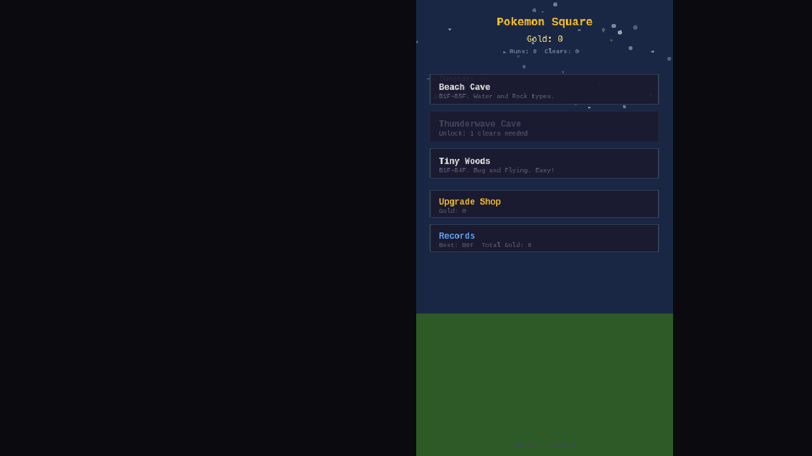
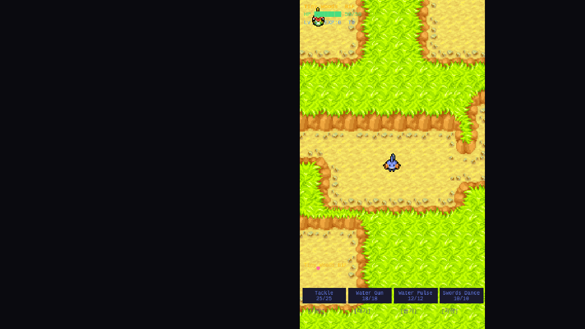

# Phase 5: Polish + 배포

## 목표
UI 폴리시, 전투 이펙트 강화, PWA 지원, GitHub Pages 배포.

## 구현 내용

### 5-1. 미니맵 + 개선된 HUD
- **미니맵**: 우측 상단 3px/타일 크기, 실시간 업데이트
  - 녹색: 플레이어, 빨강: 적, 분홍: 아이템, 금색: 계단
  - 토글 버튼 [Map]으로 표시/숨김
- **그래픽 HP 바**: 텍스트 대신 채워지는 색상 바
  - 초록(>50%) → 노랑(>25%) → 빨강 컬러 변화
- **포켓몬 초상화**: 좌상단 Mudkip Idle 스프라이트

### 5-2. 전투 이펙트
- **데미지 팝업**: 피격 시 숫자가 위로 떠오르며 페이드아웃
  - 효과적: 빨강 + 큰 글자, 비효과적: 파랑
- **힐 팝업**: 초록색 +HP 숫자
- **화면 흔들림**: 효과가 뛰어난(2x) 공격 시 카메라 셰이크

### 5-3. PWA + GitHub Pages 배포
- `manifest.json`: 이름, 아이콘, 세로 모드, 테마색
- `icon-192.png`, `icon-512.png`: 금색 "P" 아이콘
- `.github/workflows/deploy.yml`: 자동 빌드/배포 파이프라인
- `vite.config.ts`: base 경로 `/poke-roguelite/`로 변경
- **라이브 URL**: https://songclaude-bot.github.io/poke-roguelite/

### 5-4. 포트폴리오 허브 등록
- `songclaude-bot.github.io`에 Poke Roguelite 별 추가

## 결과 스크린샷

Hub — 3개 던전 목록, Thunderwave Cave는 잠금 상태

Beach Cave B1F — 미니맵과 개선된 HUD

Tiny Woods B1F — 숲 타일셋과 벌레/비행 포켓몬

## 파일 변경

| 파일 | 변경 |
|------|------|
| `src/scenes/DungeonScene.ts` | 미니맵, 그래픽 HP바, 데미지/힐 팝업, 화면 흔들림 |
| `src/scenes/BootScene.ts` | 버전 v0.5.0 업데이트 |
| `index.html` | PWA 메타태그 추가 |
| `public/manifest.json` | **신규** — PWA 매니페스트 |
| `public/icon-192.png` | **신규** — PWA 아이콘 |
| `public/icon-512.png` | **신규** — PWA 아이콘 |
| `.github/workflows/deploy.yml` | **신규** — CI/CD 파이프라인 |
| `vite.config.ts` | base 경로 변경 |
| `.gitignore` | package-lock.json 허용 |
